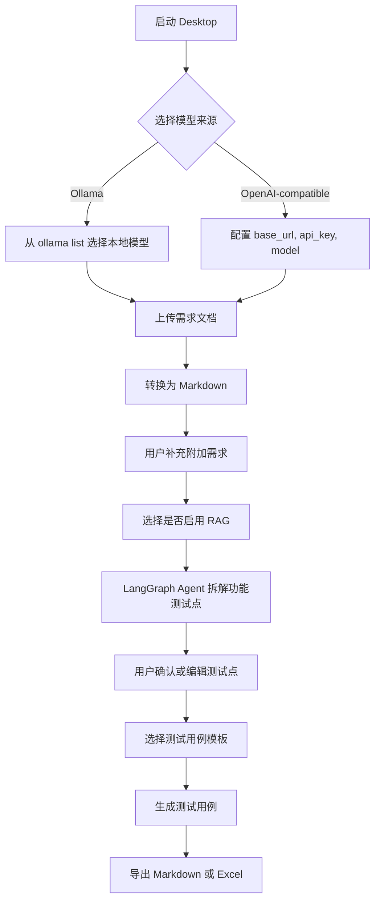
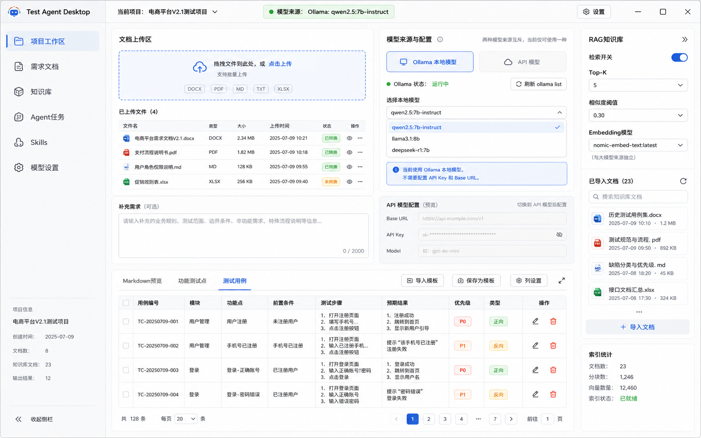
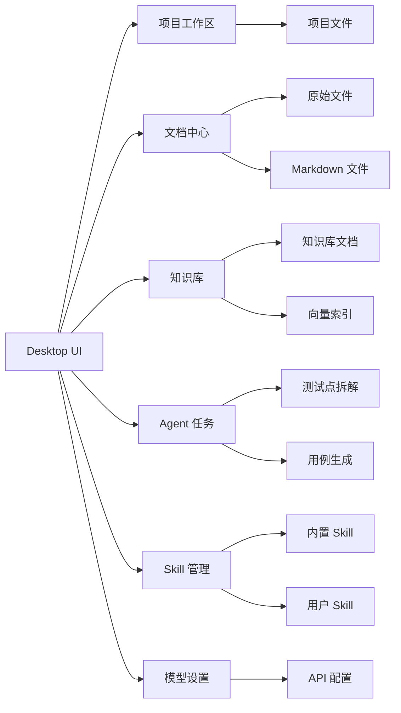
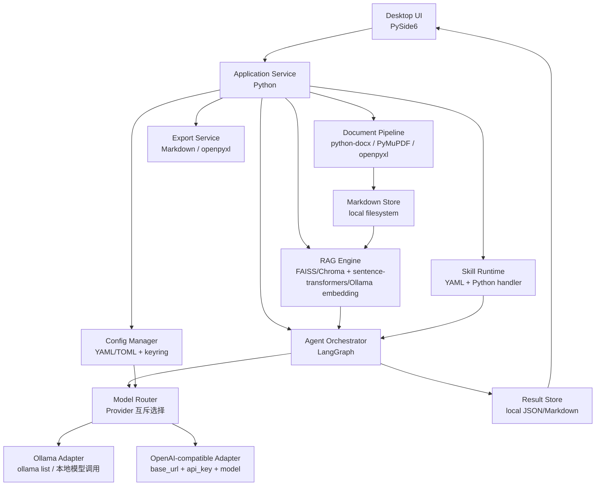
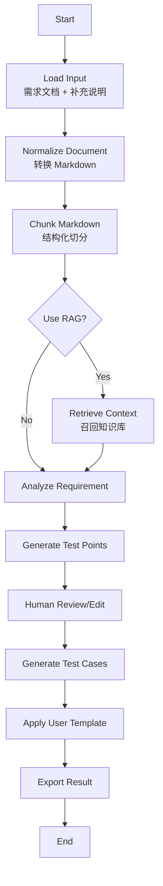

# 测试人员专属 AI Agent Desktop PRD 与技术架构

## 1. 产品概述

### 1.1 产品名称

Test Agent Desktop

### 1.2 产品定位

面向测试人员的本地 Desktop AI Agent, 用于把原始需求文档、用户补充说明、项目知识库转化为功能测试点和测试用例, 并支持后续通过 Skill 扩展 PPT、缺陷分析、接口测试设计等能力。

### 1.3 目标用户

- 初级/中级测试工程师: 快速理解需求, 生成测试点和测试用例。
- 高级测试工程师/测试负责人: 统一用例模板, 沉淀项目知识库。
- Agent 开发学习者: 通过真实测试业务场景学习文档解析、RAG、LangGraph、插件化和 Desktop 开发。

### 1.4 一期目标

1. 支持上传非固定格式需求文档。
2. 将需求文档统一转换为 Markdown。
3. 支持用户输入补充需求信息。
4. 拆解功能测试点。
5. 按用户模板生成测试用例。
6. 支持选择模型来源: Ollama 本地模型或 OpenAI-compatible API 模型。
7. 支持本地 RAG 知识库。
8. 支持 Skill 扩展机制。

### 1.5 非一期目标

- 多人协作。
- 云端账号体系。
- 在线数据库服务。
- 企业权限管理。
- 自动执行测试。

## 2. 核心用户流程



## 3. 功能需求

### 3.1 模型配置

用户可以在 Desktop 中选择模型来源。模型来源分为两种互斥模式:

1. Ollama 本地模型模式。
2. OpenAI-compatible API 模型模式。

Ollama 本地模型模式:

- 不配置 API Key。
- 不配置 Base URL。
- 直接读取 `ollama list` 返回的本地模型。
- 用户从本地模型列表中选择模型。

OpenAI-compatible API 模型模式:

- 配置 Base URL。
- 配置 API Key。
- 配置 Model Name。
- 通过 `base_url + api_key + model` 调通模型。

两个模式不能同时生效。用户切换模型来源时, UI 只展示当前模式需要的配置项。

### 3.2 文档上传

支持上传以下格式:

- `.docx`
- `.pdf`
- `.md`
- `.txt`
- `.xlsx`

上传后保留原始文件, 并生成对应 Markdown 文件。

### 3.3 Markdown 标准化

所有原始文档先统一转换为 Markdown, 再进入后续处理流程。

Markdown 标准化目标:

- 降低不同文档格式带来的解析差异。
- 为 RAG 分块提供稳定输入。
- 为 LangGraph Agent 提供统一上下文。
- 便于用户预览、编辑和归档。

### 3.4 补充需求

用户上传文档后, 可以继续输入补充信息, 例如:

- 业务规则。
- 测试范围。
- 边界条件。
- 兼容性要求。
- 非功能需求。
- 特殊流程说明。

Agent 生成测试点时, 需要同时结合需求文档和补充需求。

### 3.5 功能测试点拆解

系统基于 Markdown 文档、补充需求和可选 RAG 上下文, 输出功能测试点。

测试点建议包含:

- 所属模块。
- 功能点。
- 正向场景。
- 反向场景。
- 边界场景。
- 异常场景。
- 数据校验点。
- 权限校验点。
- 兼容性关注点。

### 3.6 测试用例生成

系统基于功能测试点生成测试用例。

默认测试用例字段:

- 用例编号。
- 所属模块。
- 功能点。
- 前置条件。
- 测试步骤。
- 预期结果。
- 优先级。
- 用例类型。
- 备注。

用户可以自定义测试用例模板, Agent 需要按照模板字段输出。

### 3.7 本地 RAG

用户可以导入项目知识库文档, 例如:

- 历史测试用例。
- 需求规范。
- 缺陷记录。
- 项目说明。
- 测试规范。

RAG 流程:

1. 导入文档。
2. 转换为 Markdown。
3. 文档切分。
4. 生成 embedding。
5. 建立本地向量索引。
6. 在测试点拆解和用例生成时召回相关上下文。

### 3.8 Skill 扩展

系统需要支持基于目录的 Skill 扩展。

每个 Skill 建议包含:

```text
skill-name/
  skill.yaml
  prompt.md
  handler.py
```

Skill 示例:

- `generate_test_cases`: 生成测试用例。
- `write_ppt`: 根据测试分析结果写 PPT。
- `analyze_defects`: 分析缺陷记录。
- `api_test_design`: 生成接口测试点。

一期只实现基础加载和调用机制, 不做复杂插件市场。

### 3.9 导出

一期导出格式:

- Markdown。
- Excel。

优先保证 Markdown 导出稳定, Excel 导出作为紧随其后的能力。

## 4. Desktop UI 原型

### 4.1 基本界面



### 4.2 UI 区域说明

- 顶部栏: 显示产品名称、当前项目、模型状态、设置入口。
- 左侧导航: 项目工作区、需求文档、知识库、Agent 任务、Skills、模型设置。
- 文档上传区: 支持拖拽上传, 展示支持格式和已上传文件列表。
- 模型配置摘要: 展示当前模型来源。Ollama 模式展示本地模型列表和运行状态; OpenAI-compatible 模式展示 Base URL、Model、API Key 脱敏信息。
- 补充需求区: 用户输入额外业务规则、测试范围和边界条件。
- 操作按钮区: 转换 Markdown、拆解测试点、生成测试用例、导出。
- 输出区: Markdown 预览、功能测试点、测试用例三个 Tab。
- RAG 知识库侧栏: 展示已导入文档、检索开关、Top-K、Embedding 模型、相似度阈值和索引统计。

## 5. 信息架构



## 6. 技术架构



### 6.1 架构技术栈

| 架构层 | 技术栈 | 作用 |
|---|---|---|
| Desktop UI | PySide6 | 跨 Windows/macOS 桌面界面 |
| 应用服务层 | Python | 串联 UI、Agent、RAG、文档处理 |
| Agent 编排 | LangGraph | 管理文档解析、测试点拆解、用例生成流程 |
| 模型路由层 | Python Provider Router | 在 Ollama 和 OpenAI-compatible 两种模式中互斥选择 |
| OpenAI-compatible 适配层 | OpenAI-compatible SDK/httpx | 通过 `base_url + api_key + model` 调用 API 模型 |
| Ollama 适配层 | Ollama CLI/API | 通过 `ollama list` 读取本地模型, 调用用户选择的本地模型 |
| 文档解析 | python-docx, PyMuPDF, openpyxl | 解析 docx、pdf、xlsx |
| Markdown 标准化 | 自研清洗器 + Markdown 文件 | 统一后续处理输入 |
| RAG 向量库 | FAISS 或 Chroma | 本地检索, Windows 无服务依赖 |
| Embedding | bge-small-zh-v1.5 / bge-m3 / Ollama embedding | 文档向量化 |
| 配置管理 | YAML/TOML + keyring | 保存模型来源、API 配置和密钥 |
| Skill 系统 | `skill.yaml` + `handler.py` + `prompt.md` | 扩展 PPT、缺陷分析等能力 |
| 导出 | Markdown, openpyxl | 导出测试用例和分析结果 |
| 打包 | PyInstaller | Windows/macOS 桌面打包 |

## 7. LangGraph 编排设计



## 8. 核心数据对象

| 对象 | 说明 |
|---|---|
| Project | 一个测试项目工作区 |
| SourceDocument | 用户上传的原始文件 |
| MarkdownDocument | 标准化后的 Markdown |
| RequirementContext | 文档内容 + 用户补充信息 + RAG 召回内容 |
| TestPoint | 功能测试点 |
| TestCase | 测试用例 |
| CaseTemplate | 用户自定义用例模板 |
| Skill | 可扩展能力 |
| ModelProvider | 模型来源配置, 包含 Ollama 或 OpenAI-compatible 两种互斥模式 |

## 9. 本地目录设计

```text
test-agent-desktop/
  app/
    desktop/
    services/
    agent/
    documents/
    rag/
    skills/
    models/
    config/
  data/
    projects/
    markdown/
    indexes/
    outputs/
  skills/
    generate_test_cases/
    write_ppt/
  tests/
  pyproject.toml
```

## 10. 开发路线

| 阶段 | 目标 | 交付物 |
|---|---|---|
| P0 | 项目骨架 | PySide6 空壳、配置页、本地项目目录 |
| P1 | 文档转 Markdown | 上传文件、解析、Markdown 预览 |
| P2 | LLM 调用 | 支持 Ollama 本地模型选择和 OpenAI-compatible API 配置, 完成一次模型调用 |
| P3 | LangGraph 流程 | 文档 -> 测试点 -> 测试用例 |
| P4 | 自定义模板 | 用户配置用例字段和输出格式 |
| P5 | 本地 RAG | 导入知识库、embedding、检索增强 |
| P6 | Skill 机制 | 加载 Skill, 执行内置 `write_ppt` 示例 |
| P7 | 打包 | Windows/macOS 可安装包 |

## 11. 关键决策

- 文档先转 Markdown: 作为强制中间层。
- Windows 无数据库: 一期使用本地文件 + FAISS/Chroma/SQLite 文件, 不依赖外部数据库服务。
- 模型来源: Ollama 和 OpenAI-compatible API 是互斥模式。Ollama 直接使用 `ollama list` 中的本地模型; API 模式才配置 `base_url + api_key + model`。
- Ollama 7B: 用于本地 RAG 和轻量生成, 复杂用例生成允许切换到 OpenAI-compatible API 模型。
- Skill 扩展: 一期只做目录加载和声明式配置。
- Desktop: 采用 PySide6, 保持 Python 技术栈统一。
